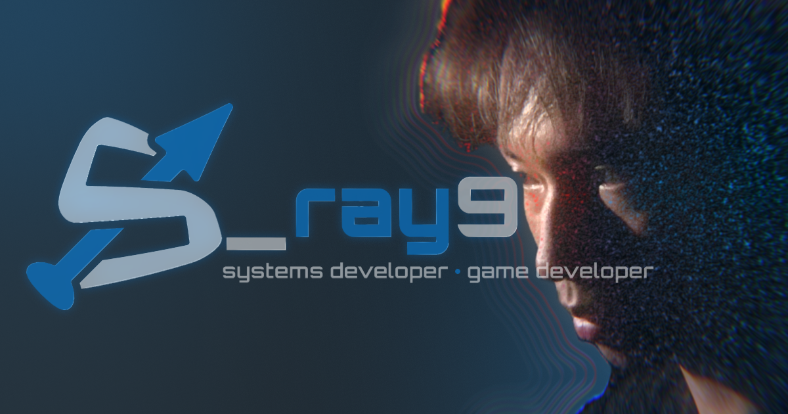

<div align="center">



# Personal Portfolio

The open-source repository for my personal portfolio website, showcasing my work in software architecture, game development, and technical writing.

[](https://github.com/s-ray9/s-ray9.github.io/actions) [](https://s-ray9.vercel.app) [](https://s-ray9.github.io) [](LICENSE)

   

</div>

---

## 🛠️ Development

### Local Setup

```bash
# Clone the repository
git clone https://github.com/s-ray9/s-ray9.github.io.git
cd s-ray9.github.io

# Install dependencies
npm install

# Start development server
npm run dev
```

## 📄 License

Distributed under the MIT License. See [LICENSE](LICENSE) for more information.
